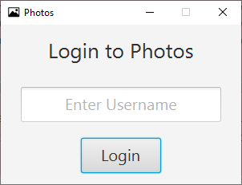
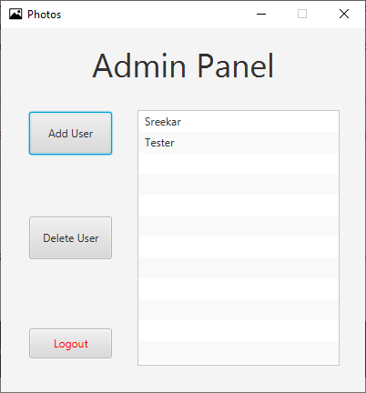
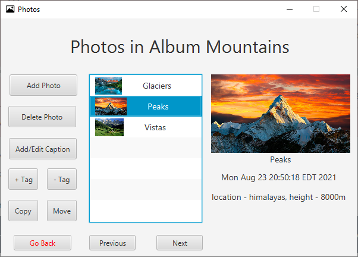

# Photos

A desktop Photos application made with JavaFX using the Model-View-Controller (MVC) architecture. The application supports multiple user sign-in and also features an admin panel to add and remove users. Upon logging in, users can create albums to store their pictures, where they can each be given unique captions and tags. Pictures can also be moved or copied between albums. There is also a search by date or tags functionality for all the pictures from all albums of the current user. User Data is saved and recovered via serialization.

